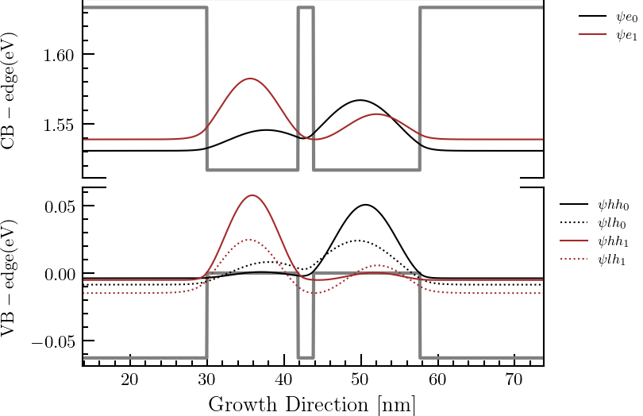

# CQWS CODES
In this repository, we share the codes used to calculate Coupled Quantum Wells (CQWs) as implemented in the PhD project of O. Ruiz-Cigarrillo, in collaboration with C.A. Bravo-Velazquez and G.A. Martinez-Zepeda. These codes are continuously being developed by the group of  [Prof. Dr. A. Lastras-Martinez](https://scholar.google.com.mx/citations?user=D7IB_lIAAAAJ&hl=en&oi=ao) and [Dra. L.E. Guevara-Macias](https://scholar.google.es/citations?user=BDxMfXYAAAAJ&hl=es&oi=ao) through student [C. Hernández-Juache](https://github.com/orgs/NanophotonIICOs/people/Citlali-Juache). The first version,refers to the initial implementation, while the second version,  was developed  with the incorporation of [AESTIMO](https://www.aestimosolver.org/) code and [SOLCORE](https://www.solcore.solar/). The objective of this repository is to enhance the codes used for numerical calculations in CQWs structures and Quantum Wells with arbitrary potential.
<p align=center>

# Example

The module needs to declare like a structure as a next example (like a [AESTIMO](https://www.aestimosolver.org/)):

``` python
class Structure(object): pass
s = Structure() # this will be our datastructure
s.structure_name="name"
# TEMPERATURE
s.T = 30 # in Kelvin
# Binding Energy
s.HHBinding =6.1e-3 #meV
s.LHBinding =6.8e-3 #meV
# Band Offset ratios
s.Qc = 0.65
s.Qv = 0.35
# Total subband number to be calculated for electrons
s.subbands = 2
# APPLIED ELECTRIC FIELD
s.Fapp = 0e4 # (V/m)
# For 1D, z-axis is choosen
s.gridfactor = 0.05#nm
# REGIONS
# Region input is a two-dimensional list input like AESTIMO(https://www.aestimosolver.org/) .
#         | Thickness (nm) | Material | Alloy fraction | Doping(cm^-3) | n or p type |
s.material =[

             [ 30.0, 'AlGaAs',   0.15,   0, 'n','Barrier'],
             [ 11.87,'GaAs'  ,      0,   0, 'n','Well'],
             [ 1.98, 'AlGaAs',   0.15,   0, 'n','Barrier'],
            [ 13.85,'GaAs'  ,      0,   0, 'n','Well'],
             [ 30.0, 'AlGaAs',   0.15,   0, 'n','Barrier'],
             ]

structure = s
nm = 1e-9
# RUN SIMULATION
model = solver.StructureFrom(structure) #
xaxis=model.xaxis/nm
cb=model.cb
vb=model.vb
results=solver.Solver(model).QuantumSolutions(absolute =True,Print=True)
solver.Solver(model).plotting(results,amp=10,axmin=30,axmax=30,eymin =-0.01,eymax=0.01,hymin=-0.2,hymax=-2,save=False)
```

<p align=center>
  
</p>
