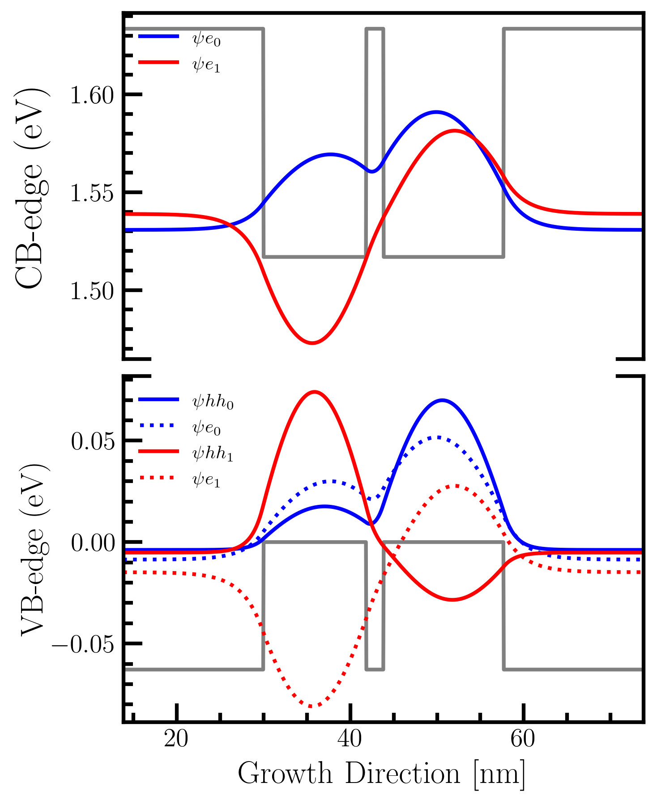

# CQWS CODES
In this repository shares the codes implemented in calculations of Coupled Quantum Wells implemented in the PhD project of O. Ruiz-Cigarrillo, C.A. Bravo-Velazquez and G.A. Martinez-Zepeda. The v1 refers to first version developed and the second version v2 was developed taken into account  [AESTIMO](https://www.aestimosolver.org/) code and [SOLCORE](https://www.solcore.solar/). The objective of this repository is to enhance the codes to perform the numerical calculations in CQWs structures. 

  

